# Continuous Integration

Continuous integration (CI) is the practice of continuously integrating (and testing) new code with your existing source code, merging all developer working copies to a shared mainline several times a day.

It aims to avoid integration problems and deliver the software often, but with the security it will work, so it's based in "maximum automation".

Basicaly, Continuous Integration also refered to as "build automation":
- Continuously integrates newly checked-in code into a build.
- Optionally runs unit tests and rejects the build if they fail.
- Also optionally can deploy builds to other servers.

# Index

* [Objectives](#objectives)
* [Technologies and tools](#)
	* [Jenkins](#jenkins)
		* [General working](#working)
		* [Best practices](#bestpractices)
		* [Tools and plugins](#tools)
			* [SVN (version control)](#svn)
			* [Git/Github (version control)](#git)
			* [Maven (compiling)](#maven)
			* [Artifactory (artifact managing)
			* [Sonar (code quality)](#sonar)
			* [Selenium (browser testing test)](#selenium)
			* [Dimensions (tool for control version and deploy)](#dimensions)
		* [Bamboo](#bamboo)

## Objectives

This document aims at make a complete description of the continuous integration system used in BEEVA projects.

Using CI we will be able to asure the software checked in on the mainline is always in a state that can be deployed.
Test, support, development and operations work together as one delivery team to automate and streamline the build, test and release process.

Continuous Delivery is the natural extension of Continuous Integration: an approach in which teams ensure that every change to the system is releasable, and that we can release any version at the push of a button.

To help in this work, there are a variety of tools and plugins available like Jenkins, Apache Continuum or Bamboo, git/github, Maven, Sonar, Selenium, etc 

## Architecture, technologies and tools

### Jenkins

Jenkins is a continuous integration and continuous delivery application that allows to build and test  software projects continuously making it easier for developers to integrate changes to the project, and making it easier for users to obtain a fresh build.

It's and open source tool, runs as java web application on container such as Tomcat.
Formely known as Hudson, and forked from the original Hudson adquired by Oracle.

#### How Jenkins works

Jenkins:
- Integrates with source control (Svn, Git, etc)
- Builds can be triggered either on a schedule o buy hitting a URL (cron+url, post-commit hooks in scm)
- What the build does is dictaded by configuration

Jenkins uses jobs to work, a job defines a sequence of tasks for Jenkins to perform.
Jobs are typically project-oriented, and when a job is triggered, Jenkins follows some defined steps (an ants script sometimes), post-build tasks can also be defined (create a WAR, copy files to another location, etc) 

[Jenkins install official documentation](https://wiki.jenkins-ci.org/display/JENKINS/Tomcat)

In the next picture you can see the list of jobs ready to be executed in a jenkins instance.

Primary options to configure, execute and a history of the executed jobs
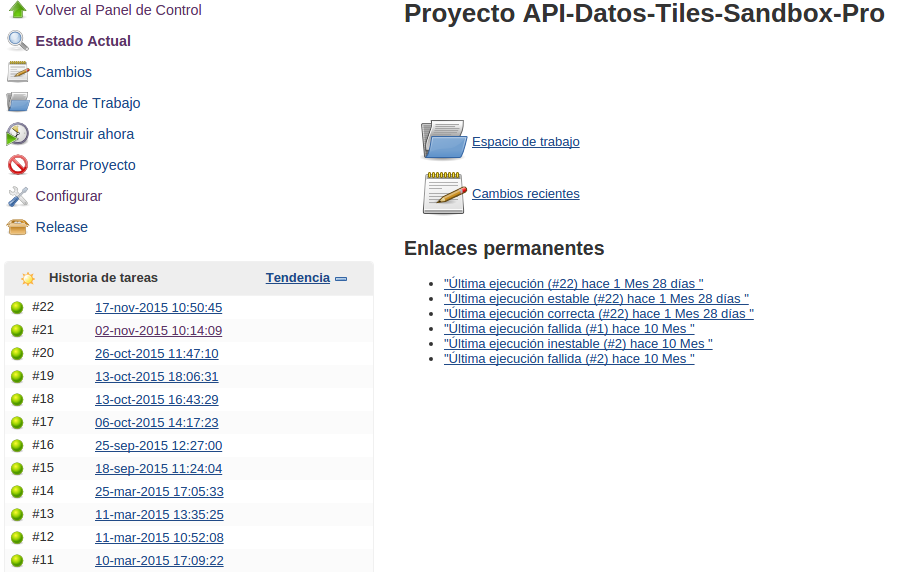

The result of a deploy in a Jenkins job:

#### Configuration

### SVN

Jenkins includes Subversion Plug-in for supporting SVN repositories. This plugin allows to configure some general properties when interacting with SVN repositories under 'Subversion' section in Manage Jenkins -> Configure System screen:
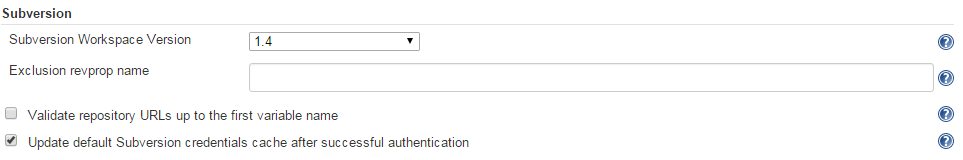

However, the most important configuration must be done inside each job. Selecting 'Subversion' in 'Source Code Management' section will show a bunch of options:
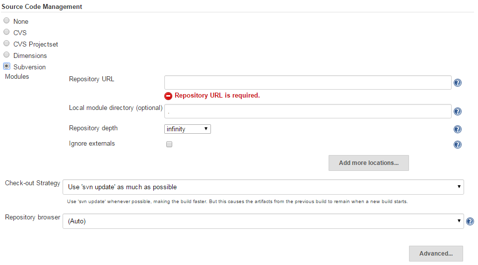

When setting up the 'Repository URL' field, Jenkins will automatically try to connect to the repository. If authentication is needed, this can be provided by clicking on 'enter credential' link under the URL field:
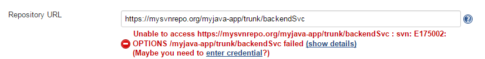

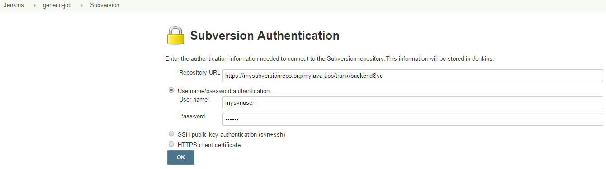

Credentials for that URL will be stored forever but can be changed whenever it's required (click on 'Repository URL' help button for more information).

### Git/Github

### Maven

Jenkins distributions contain, by default, a Maven Project plugin version to allow running Maven projects. This plugin must be first set up to use a local Maven installation. If there's no local installation, we can select and download a version directly from the configuration section (Manage Jenkins -> Configure system):

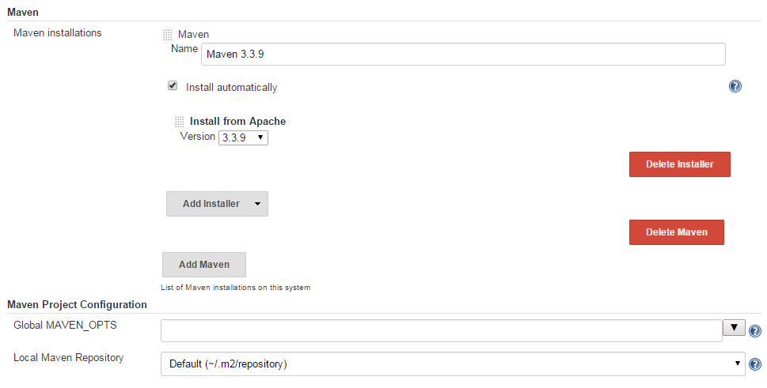

Once Maven plugin is ready, Maven projects can be run on Jenkins in two different ways:

- Running a "Maven task" step in any kind of job:

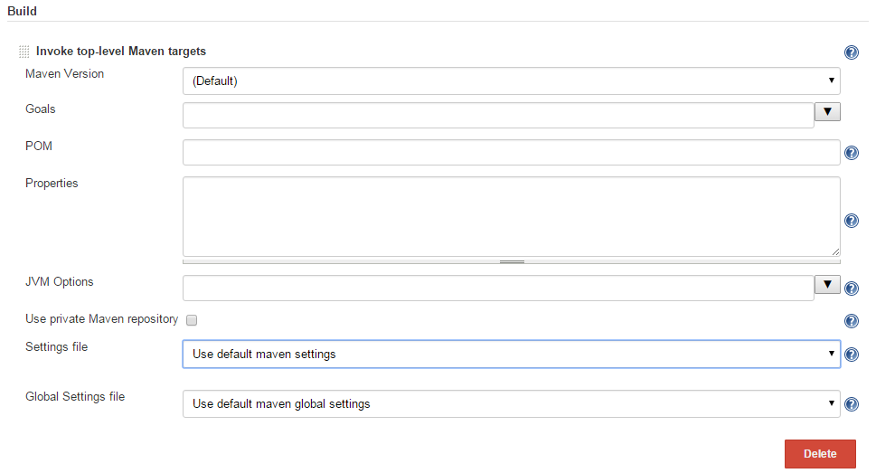

This way is useful when several independent Maven projects will run in the same job.

- Creating a "Maven project" job:

This kind of job allows to easily configure some maven-oriented enhancenments in order to automate continuous integration between different projects.

Maven jobs can be configured to be triggered when any of its snapshot dependencies is built on the same Jenkins. This is achieved by parsing the POMs.
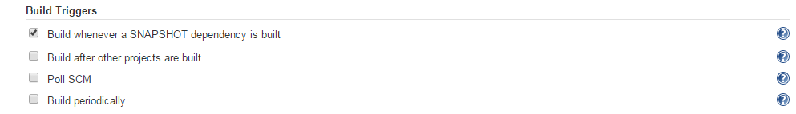

Build stage can be deeply customized without changing POMs files. Some interesting Maven options can be configured by checking/unchecking them.
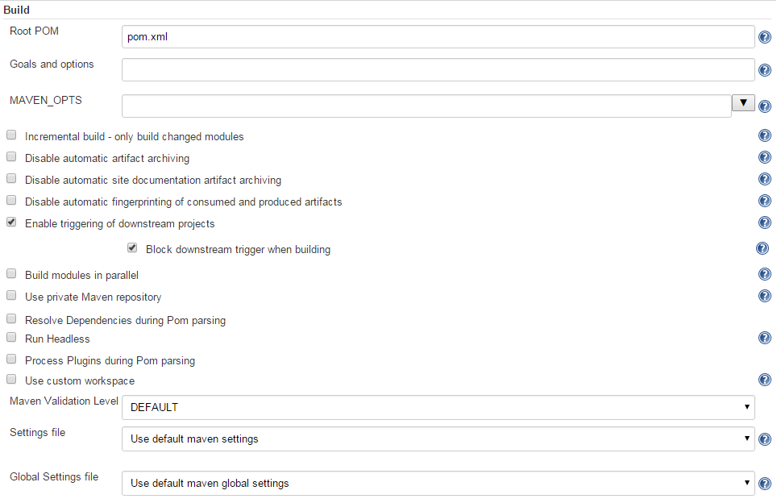

A helpful post-build action is also available: we can automatically upload artifacts to Maven repositories once the build is done.
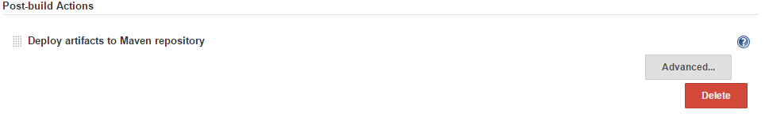

Some useful metrics are shown by default, such as Build time trend, that provides a visual metric of the time spent to build the project, or Test result trend, which shows the successful/failed test ratio history.
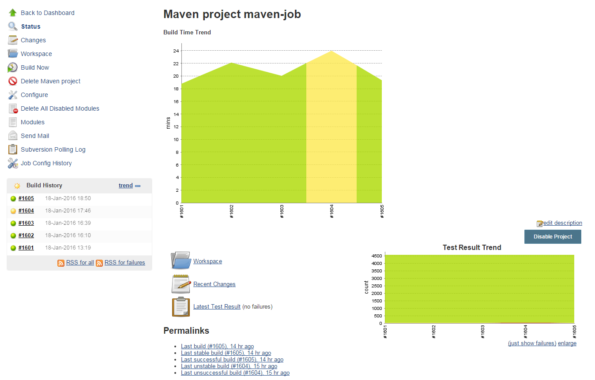

By clicking on Latest Test Result link, we can check the test results related to the last build. These results are displayed by Maven module.
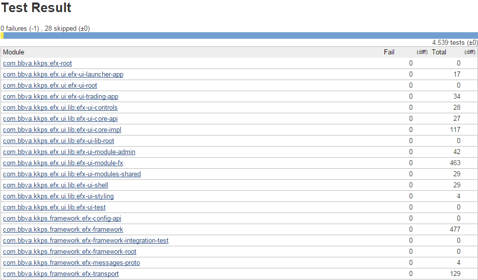

### Sonar

Sonar can be used in Jenkins by installing [SonarQube plugin](https://wiki.jenkins-ci.org/display/JENKINS/SonarQube+plugin). This plugin provides connectivity to SonarQube servers and SonarQube Scanner enhancements. new options to be selected in Jenkins jobs in order to run Sonar analysis.

Some configuration must be done prior to use SonarQube plugin (Manage Jenkins -> Configure system):

- At least, a SonarQube server must be set up (but we can configure as many SonarQube servers as desired):
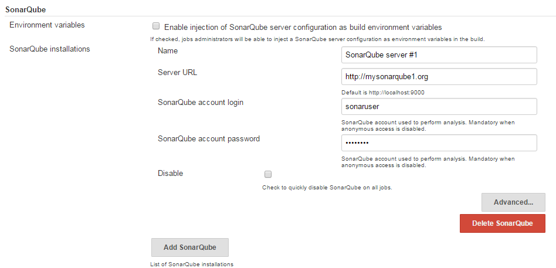

- At least, a local SonarQube Runner installation is required (but we can configure as many SonarQube runners as desired). SonarQube Runner can be installed from Configure System either from Maven Central or by selecting the installer:
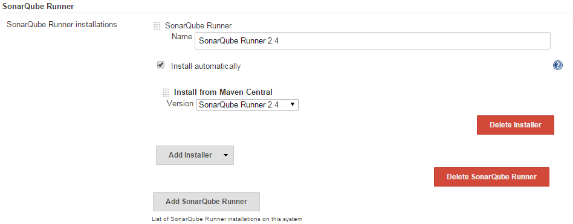

Now required configuration is done, SonarQube analysis can be invoked from jobs. If 'Enable injection of SonarQube server configuration as build environment variables' option was checked in SonarQube Server configuration, we can inject SonarQube configuration to the job and use the variables within a Maven instruction:
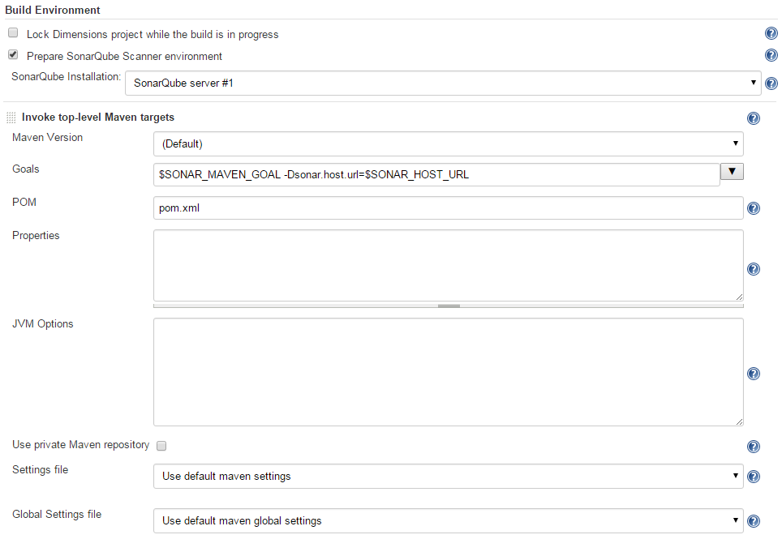

Otherwise, we can add a Standalone SonarQube Analysis build step and set up the properties:
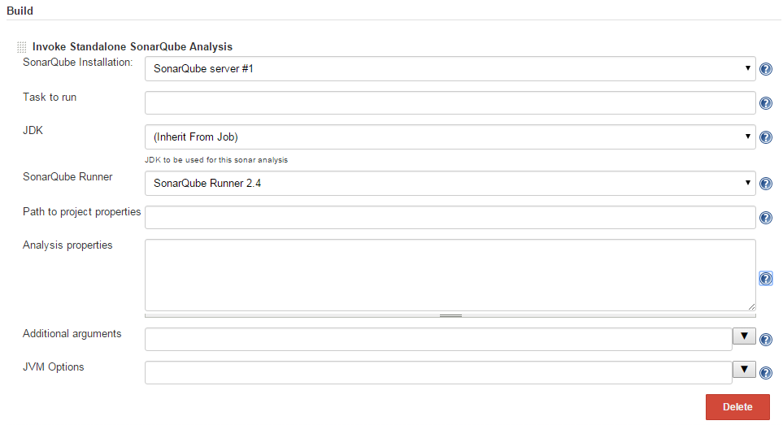

### Selenium

### Dimensions

Dimensions CM is a tool developed by Serena that provides capabilities for managing the whole lifecycle of a project: revision control, change, build and release management ([more info](http://www.serena.com/index.php/en/products/application-development/dimensions-cm/overview/)).

Thanks to this [unofficial plugin](https://wiki.jenkins-ci.org/display/JENKINS/Dimensions+Plugin), Jenkins can connect to Dimensions to:
* Download code from streams, projects and baselines.
* Deliver content into Dimensions streams and projects
* Create baselines from Dimensions streams and projects content.

Connection configuration can be globally set up through 'Manage Jenkins -> Configure system' screen (connection details can be overriden by any job if required):
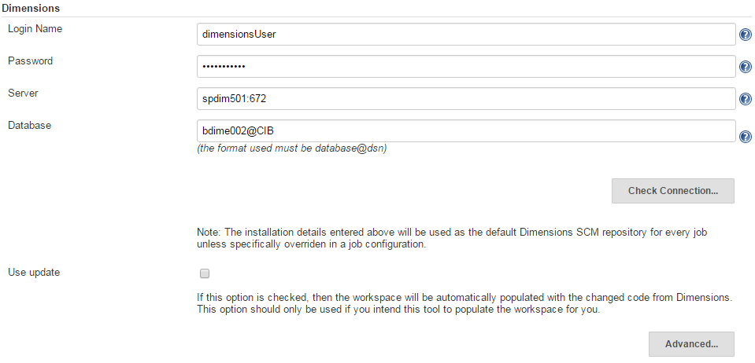

Dimensions plugin allows jobs to download source code from a Dimensions repository by choosing 'Dimensions" under 'Source Code Management' section:
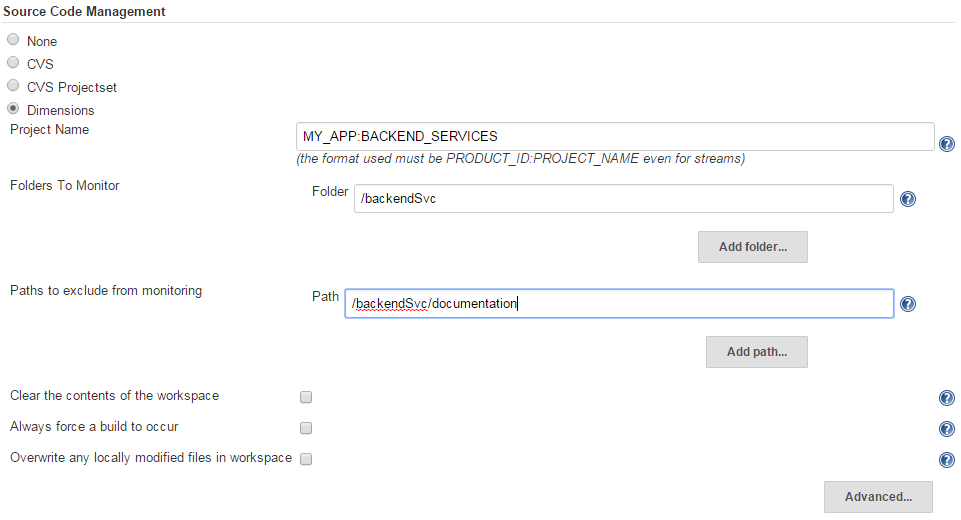

Clicking on 'Advance...', connection configuration can be set up only for the job:
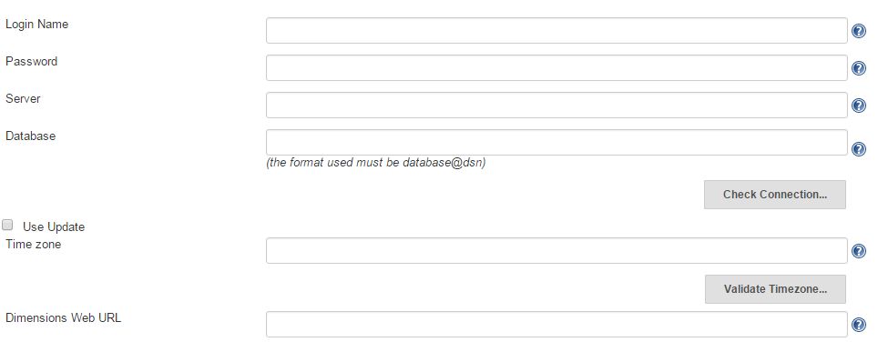

If delivering build artifacts into Dimensions is required, we must add a 'Load any build artifacts into the Dimensions repository' post-build step. There we will add a pattern for each resource path we want to deliver. We can also add exclusions pattern to avoid delivering some content in any path. Patterns can be Reg-ex expressions or Ant expressions:
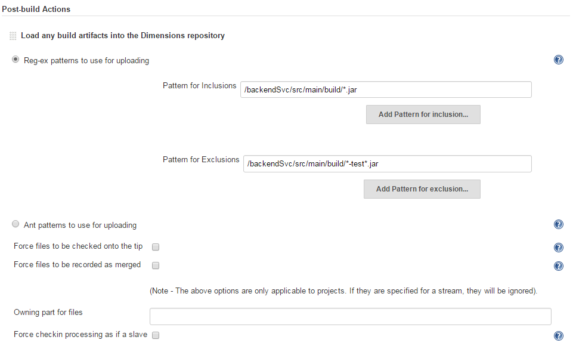

Finally, Dimensions plugin provides another post-build step to create a baseline in the Dimensions repository. To perform that operation, we will add a 'Tag successful builds in Dimensions as a baseline' step:
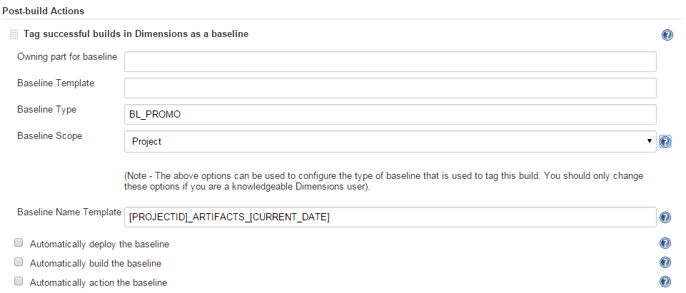

### Bamboo

Bamboo is a continuous integration and delivery tool that ties automated builds, tests and releases together in a single workflow, it integrates perfectly with Jira ( a the project management tool for agile teams, both are atlassian products)

If connecting with Bitbucket and JIRA Software, details like JIRA issues, commits, reviews and approvals follow each release of your application from development to production.

Here can see a bamboo sample project [https://confluence.atlassian.com/bamboo/a-sample-deployment-project-365658897.html](https://confluence.atlassian.com/bamboo/a-sample-deployment-project-365658897.html)

[BEEVA](http://www.beeva.com) | 2015

