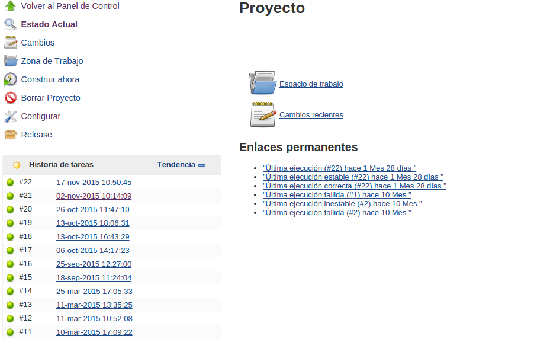

# Continuous Integration

Continuous integration (CI) is the practice of continuously integrating (and testing) new code with your existing source code, merging all developer working copies to a shared mainline several times a day.

It aims to avoid integration problems and deliver the software often, but with the security it will work, so it's based in "maximum automation".

# Index

* [Objectives](#objectives)
* [Technologies and tools](#)
	* [Jenkins](#jenkins)
		* [General working](#working)
		* [Best practices](#bestpractices)
		* [Tools and plugins](#tools)
			* [Maven (compiling)](#maven)
			* [SVN (version control)](#svn)
			* [Git/Github (version control)](#git)
			* [Sonar (code quality)](#sonar)
			* [Selenium (browser testing test)](#selenium)
			* [Dimensions (tool for control version and deploy)](#dimensions)
		* [Bamboo](#bamboo)

## Objectives

This document aims at make a complete description of the continuous integration system used in BEEVA projects.

Using CI we will be able to keep a making sure the software checked in on the mainline is always in a state that can be deployed. 
Test, support, development and operations work together as one delivery team to automate and streamline the build, test and release process.

Continuous Delivery is the natural extension of Continuous Integration: an approach in which teams ensure that every change to the system is releasable, and that we can release any version at the push of a button.

To help in this work, there are a variety of tools available like Jenkins, Apache Continuum or Bamboo.

## Architecture, technologies and tools

### Jenkins

Jenkins is an continuous integration and continuous delivery application that increases your productivity allowing to build and test your software projects continuously making it easier for developers to integrate changes to the project, and making it easier for users to obtain a fresh build.

#### How Jenkins work

Jenkins needs an installed Tomcat versión 5.0 or later.
Jenkins requires Java7 or above to function. Java8 is recommended. Jenkins requires a fair amount of memory to operate well. Smaller installations should start around 256MB-1GB.

[Jenkins install official documentation](https://wiki.jenkins-ci.org/display/JENKINS/Tomcat)

In the next picture you can see the list of jobs ready to be executed in a jenkins instance.

Primary options to configure, execute and a history of the executed jobs

The result of a deploy in a Jenkins job:

#### Configuration

### Maven

### Sonar

### Bamboo

Bamboo is a continuous integration and delivery tool that ties automated builds, tests and releases together in a single workflow, it integrates perfectly with Jira ( a the project management tool for agile teams, both are atlassian products)

If connecting with Bitbucket and JIRA Software, details like JIRA issues, commits, reviews and approvals follow each release of your application from development to production.

Here can see a bamboo sample project [https://confluence.atlassian.com/bamboo/a-sample-deployment-project-365658897.html](https://confluence.atlassian.com/bamboo/a-sample-deployment-project-365658897.html)

[BEEVA](http://www.beeva.com) | 2015

